# Enterprise KB 企业级本地知识库问答系统 — 技术架构与设计规范文档

> **系统版本**：v1.1.0  
> **适用环境**：Node.js 20+ (LTS) / Express 5 / SQLite 3 (WAL) / TypeScript 5.7  
> **文档密级**：企业内部技术规范  
> **文档维护**：DeepMind Pair Programming & Engineering Team

---

## 目录 (Table of Contents)

1. [系统概述与核心设计理念](#1-系统概述与核心设计理念)
2. [技术栈与生态选型全景](#2-技术栈与生态选型全景)
3. [整体系统架构与关键数据流](#3-整体系统架构与关键数据流)
4. [数据库与混合检索索引引擎](#4-数据库与混合检索索引引擎)
5. [多模态文档提取与分块流水线](#5-多模态文档提取与分块流水线)
6. [ReAct 智能代理与大模型交互引擎](#6-react-智能代理与大模型交互引擎)
7. [Model Context Protocol (MCP) 开放协议集成](#7-model-context-protocol-mcp-开放协议集成)
8. [多租户权限控制 (RBAC) 与安全审计](#8-多租户权限控制-rbac-与安全审计)
9. [前端架构设计与客户端驱动交互](#9-前端架构设计与客户端驱动交互)
10. [运维部署、健康检查与容灾备份](#10-运维部署健康检查与容灾备份)
11. [REST API 端点规范与源码目录清单](#11-rest-api-端点规范与源码目录清单)

### 图表索引

| 类型 | 图表 | 所在章节 |
| :--- | :--- | :--- |
| 思维导图 | 产品能力与设计原则全景 | 1.3 |
| 架构图 | 逻辑分层与运行时边界 | 3.0 |
| 时序图 | 智能问答 ReAct / SSE | 3.1 |
| 工程流程图 | 文档上传与索引流水线 | 3.2 |
| 工程图 | 本地目录差量同步 | 3.3 |
| ER 图 | 实体关系数据模型 | 4.1 |
| 工程图 | 混合检索双引擎融合 | 4.2 |
| 工程流程图 | 结构感知分块 | 5.2 |
| 状态机 | ReAct 代理循环 | 6.1 |
| 工程图 | Agent 工具分发 | 6.1 |
| 状态机 | ReasoningStreamFilter | 6.2 |
| 架构图 | MCP 双通道集成 | 7 |
| 工程流程图 | RBAC 鉴权与 KB 隔离 | 8.1 |
| 时序图 | 审计日志写入 | 8.3 |
| 架构图 | 前端页面与组件拓扑 | 9.1 |
| 部署图 | Docker / 健康检查 / 备份 | 10.2 |
| 模块图 | 源码依赖关系 | 11.2 |

---

## 1. 系统概述与核心设计理念

### 1.1 系统定位
**Enterprise KB** 是一套专为企业私有化内网环境打造的**高安全、低运维、双引擎驱动**的本地知识库与智能问答协同平台。  
系统支持将多格式企业知识文档（Word、Excel、PowerPoint、PDF、Markdown、纯文本及各类源代码）集中归集，通过自动化解析流水线切分为结构感知的文本分块，并同步构建 **SQLite FTS5 全文检索索引** 与 **高维 Dense Vector 密集语义向量索引**。

基于自然语言问答时，后端内置自主 **ReAct (Reasoning + Acting) 代理框架**，使大语言模型能够根据用户提问，按需组合调用全文检索、语义检索、代码正则匹配与目录探测工具，生成严格溯源且具备行号锚点的精准回答。

### 1.2 核心架构原则

> [!IMPORTANT]
> **企业级核心设计原则**
> 1. **零外部服务重型依赖 (Zero Heavy External Infra)**：摈弃 ES、Milvus、Redis 等分布式集群，单机持久化完全基于 SQLite 3 WAL 引擎，极大地降低内网私有化部署和后期运维成本。
> 2. **数据绝不出局域网 (Data Sovereignty)**：完全支持私有化部署模型（如 Ollama、LocalAI、vLLM），所有文档解析、向量化嵌入和语义检索全链路闭环在本地服务器。
> 3. **精准溯源与幻觉防御 (Grounded Citations)**：大模型强制遵循“检索优先、依文答题”的 System Prompt，所有推论均提供来源文档与精确行号（`filename:line`），禁止无依据臆测。
> 4. **深度思考流式解耦 (Reasoning Stream Decoupling)**：对 DeepSeek-R1 / Qwen 等具备 `<think>` 思考标签的大模型，通过状态机在服务端实时剥离思考过程，前端保持整洁呈现。
> 5. **开放协议标准化 (Model Context Protocol Ready)**：原生实现标准 MCP 协议，支持 stdio 进程管道与远程 HTTP 传输，让 IDE（Cursor、Windsurf）及桌面 AI 客户端（Claude Desktop）即插即用接入企业知识。

### 1.3 产品能力思维导图

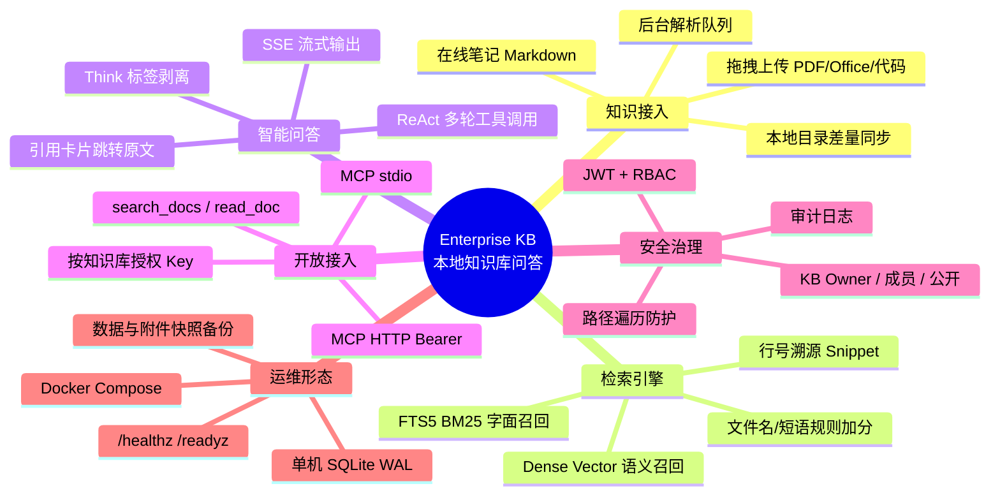

---

## 2. 技术栈与生态选型全景

```mermaid
graph TD
    subgraph Client Layer ["客户端展示层 (Client)"]
        VanillaJS["原生现代 JavaScript (ES2022)"]
        SSEClient["EventSource / Fetch SSE 流式客户端"]
        MarkedPurify["marked.js + DOMPurify 安全渲染"]
    end

    subgraph Transport Layer ["接入与传输层 (Transport)"]
        Express5["Express 5.0 (Async Native)"]
        JWTAuth["JWT 无状态令牌 (jsonwebtoken)"]
        Bcrypt["Bcrypt.js 密码单向哈希"]
        CorsMulter["CORS 白名单 + Multer 流式写盘"]
    end

    subgraph Engine Layer ["计算与编排层 (Core Engine)"]
        ReActLoop["ReAct 智能代理循环 (LLMExecutor)"]
        ThinkFilter["ReasoningStreamFilter (思考标签过滤)"]
        OpenAISDK["OpenAI SDK (兼容全量推理模型)"]
        MCPServer["Model Context Protocol (MCP) Server"]
    end

    subgraph Data Pipeline ["数据处理与索引管道 (Data & Index)"]
        Parsers["多模态解析器 (pdf-parse / mammoth / xlsx)"]
        Chunker["结构感知分块器 (Markdown/章节识别)"]
        Embedder["文本向量化模块 (Embedding API Client)"]
    end

    subgraph Storage Layer ["存储层 (Storage)"]
        BetterSQLite["better-sqlite3 11 (WAL 并发模式)"]
        FTS5["SQLite FTS5 (Unicode61 + Trigram)"]
        VectorBlob["Float32Array BLOB 向量存储"]
        LocalDisk["本地文件系统 (storage/kb_*)"]
    end

    Client Layer --> Transport Layer
    Transport Layer --> Engine Layer
    Engine Layer --> Data Pipeline
    Data Pipeline --> Storage Layer
    Engine Layer --> Storage Layer
```

### 技术选型矩阵

| 技术维度 | 选型组件 | 选用版本 | 架构收益与决策理由 |
| :--- | :--- | :--- | :--- |
| **运行时** | Node.js | v20+ LTS | 原生支持 Fetch API、ESM 规范，长期技术支持与高并发 I/O。 |
| **开发语言** | TypeScript | v5.7 | 严格静态类型检查，消灭运行时空指针与对象结构不一致缺陷。 |
| **HTTP 框架** | Express | v5.0 | 原生支持 `async/await` 异常捕获，路由中间件生态极佳。 |
| **关系型存储** | SQLite via better-sqlite3 | v11.8 | 同步执行零回调地狱，纳秒级进程内调用，无网络开销；开启 WAL 读写并发。 |
| **全文检索** | SQLite FTS5 Extension | 内置 | 内存映射全文引擎，支持 BM25 算法、通配符和中文 Trigram 分词。 |
| **向量计算** | 原生 Float32Array + BLOB | 内置 | 向量存储在 SQLite BLOB 列，无须额外向量数据库即可完成毫秒级余弦相似度匹配。 |
| **文档解析** | `pdf-parse` / `mammoth` / `xlsx` | 稳定版 | 纯 JavaScript 实现，免安装 Python 或系统级 LibreOffice 依赖。 |
| **大模型生态** | `openai` 官方 Node SDK | v4.77 | 统一标准化接口，无缝对接 Ollama、DeepSeek、MiniMax、Qwen、OpenAI 等。 |
| **工具生态** | `claude-tools-kit` | 本地包 | 标准化 Read、Grep、Glob 工具实现，适配 OpenAI Function Calling Schema。 |
| **协议拓展** | `@modelcontextprotocol/sdk` | v1.5 | 遵循 Anthropic 发布的 MCP 协议标准，统一企业知识服务对外开放形式。 |

---

## 3. 整体系统架构与关键数据流

### 3.0 逻辑架构与信任边界

下图按运行时进程划分：浏览器只持有 JWT；Express 进程内完成鉴权、ReAct、解析与检索；SQLite 与 `storage/` 同机持久化；大模型可走内网 Ollama / vLLM，文档原文不出局域网。

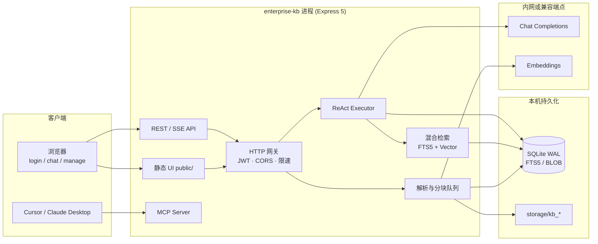

### 3.1 智能问答时序流 (Q&A Sequence Flow)

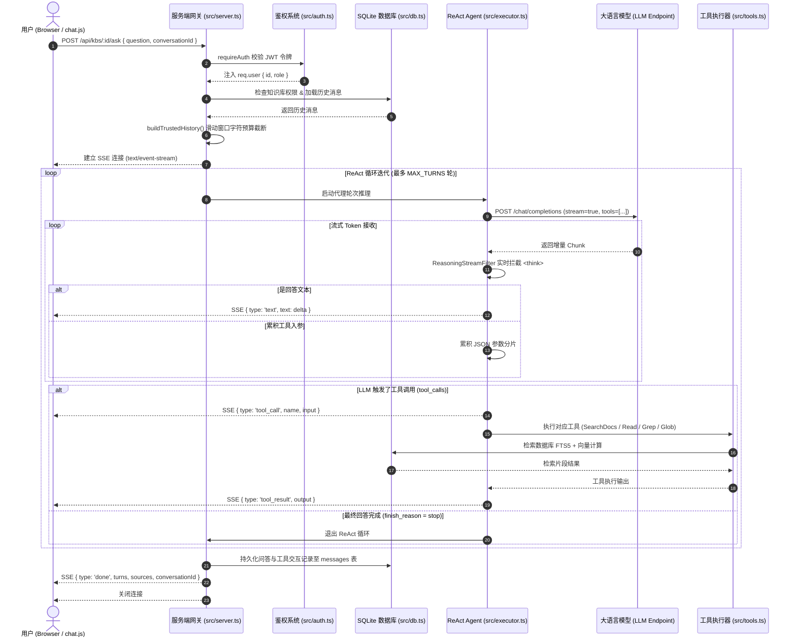

### 3.2 文档上传与向量化索引流水线

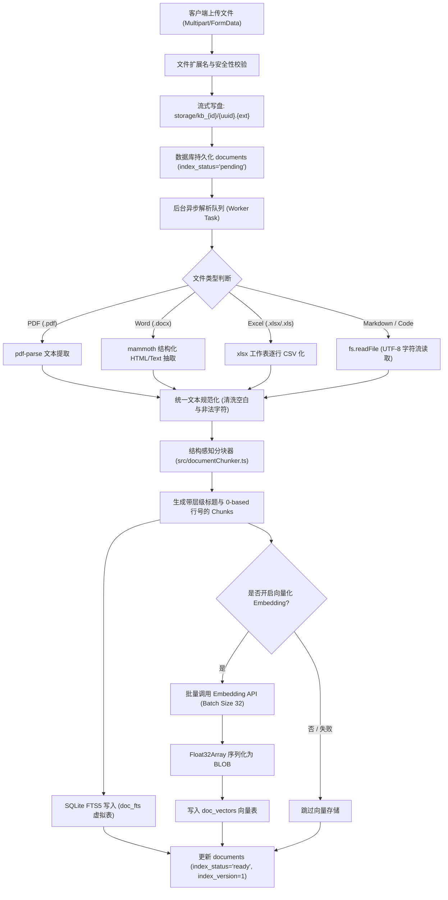

### 3.3 本地目录差量同步工程图

管理员为知识库绑定 `sync_source_path` 后，扫描结果与已索引文档按路径/指纹比对，只对新增、变更、删除项入队，避免整库重解析。

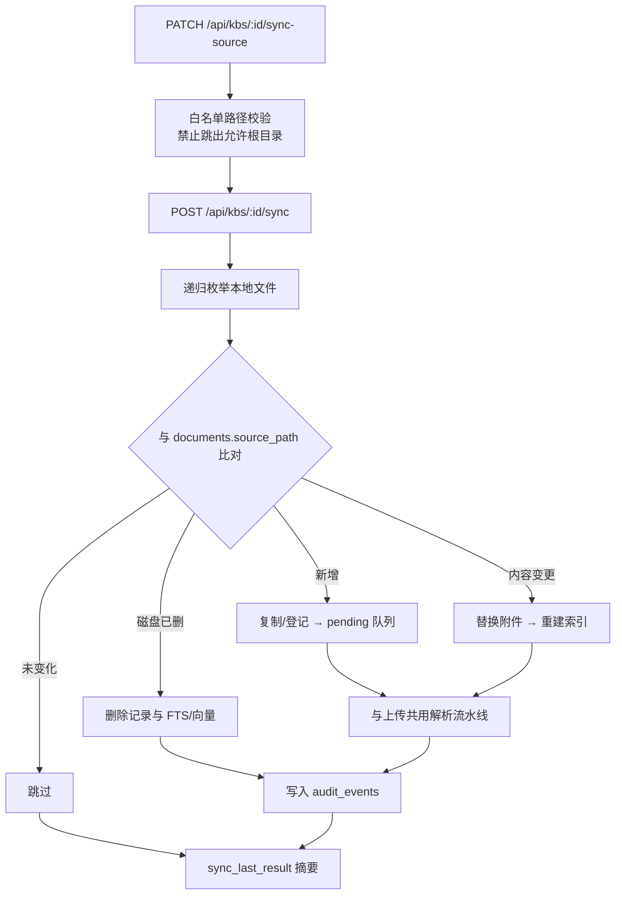

---

## 4. 数据库与混合检索索引引擎

### 4.1 实体关系数据模型 (E-R Diagram)

```mermaid
erDiagram
    users ||--o{ knowledge_bases : "owns"
    users ||--o{ conversations : "participates"
    users ||--o{ audit_events : "triggers"
    users ||--o{ kb_access : "has"

    knowledge_bases ||--o{ documents : "contains"
    knowledge_bases ||--o{ conversations : "hosts"
    knowledge_bases ||--o{ kb_access : "granted_to"
    knowledge_bases ||--o{ mcp_keys : "scoped_to"

    documents ||--o{ doc_fts : "indexed_in"
    documents ||--o{ doc_vectors : "embedded_in"

    conversations ||--o{ messages : "consists_of"
    conversations ||--o{ conversation_feedback : "evaluated_by"

    users {
        int id PK
        string username UK
        string password_hash
        string role "admin | user"
        int created_at
    }

    knowledge_bases {
        int id PK
        string name
        string description
        string system_prompt
        int owner_id FK
        int is_public "0 | 1"
        string sync_source_path
        int sync_last_at
        string sync_last_result
        int created_at
    }

    documents {
        int id PK
        int kb_id FK
        string filename UK
        string original_name
        int size
        string source_type "upload | text | sync"
        string source_path
        string index_status "pending | processing | ready | error"
        int index_version
        string index_error
        int created_at
    }

    doc_fts {
        string content
        string original_name UNINDEXED
        string file_path UNINDEXED
        int kb_id UNINDEXED
        int doc_id UNINDEXED
        int chunk_line UNINDEXED
    }

    doc_vectors {
        int id PK
        int kb_id FK
        int doc_id FK
        int chunk_line
        blob embedding "Float32Array Binary"
        int created_at
    }

    conversations {
        int id PK
        int kb_id FK
        int user_id FK
        string title
        int is_pinned "0 | 1"
        int created_at
        int updated_at
    }

    messages {
        int id PK
        int conversation_id FK
        string role "user | assistant | tool"
        string content
        string tool_calls
        string tool_call_id
        int seq
        int created_at
    }

    conversation_feedback {
        int id PK
        int conversation_id FK
        int user_id FK
        int rating "1: 赞, -1: 踩"
        string reason "doc_missing | wrong_answer | not_found | other"
        string comment
        int created_at
    }

    mcp_keys {
        int id PK
        string key_hash UK
        string key_prefix
        string label
        int user_id FK
        string kb_ids "JSON Array"
        int created_at
        int last_used_at
    }
```

### 4.2 双引擎混合检索算法 (Hybrid Search Architecture)

为了在兼顾专业术语、文件名、代码符号的**字面精确匹配**的同时，实现同义表达和长尾提问的**语义泛化召回**，Enterprise KB 自研了加权混合检索算法：

$$\text{FinalScore} = \alpha \cdot \text{BM25Score}_{\text{norm}} + \beta \cdot \text{VectorSimilarity} + \gamma \cdot \text{RuleBonus}$$

其中 $\alpha = 0.5$, $\beta = 0.4$, $\gamma = 0.1$。

#### 检索阶段分步拆解：
1. **FTS5 多级倒排索引召回**：
   - **严格 AND 匹配**：分词构建 `"词A" AND "词B"`，使用 SQLite 内部 BM25 进行词频与逆文档频率计算。
   - **宽松 OR 匹配**：若严格 AND 命中文档数低于 `candidateLimit`，降级触发 `"词A" OR "词B"` 补足候选。
   - **Trigram 模糊扫描**：针对中英文专有名词、版本号和代码函数名，利用子串模糊匹配作为防御网兜底。
2. **Dense Vector 余弦相似度计算**：
   - 提取用户提问生成 Dense Vector。
   - 从 `doc_vectors` 批量加载对应知识库的 BLOB 数据，在 Node.js 内存中以 typed array 执行余弦夹角计算：
   $$\text{CosineSim}(\mathbf{u}, \mathbf{v}) = \frac{\mathbf{u} \cdot \mathbf{v}}{\|\mathbf{u}\|_2 \|\mathbf{v}\|_2}$$
3. **加权融合与 Snippet 视窗截取**：
   - 按照文档 ID 与切片行号（`docId:line`）进行去重合并；
   - 对文件名匹配（+240分）、短语连词匹配（+120分）给予确定性奖励加分；
   - 截取匹配点前后 240 字符视窗，嵌入 `>>>匹配词<<<` 高亮标记返回至 Agent。

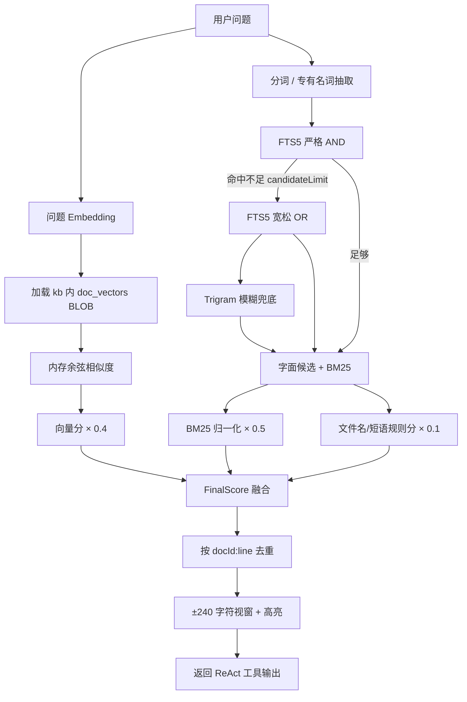

---

## 5. 多模态文档提取与分块流水线

### 5.1 解析适配矩阵

| 格式分类 | 支持扩展名 | 解析引擎 | 核心提取策略 |
| :--- | :--- | :--- | :--- |
| **便携文档** | `.pdf` | `pdf-parse` | 提取纯文本流并过滤空白控制字符，保留跨页逻辑结构。 |
| **办公文档** | `.docx` | `mammoth` | 提取段落与表格文本，自动滤除 Word 复杂冗余样式 XML。 |
| **数据表格** | `.xlsx`, `.xls` | `xlsx (SheetJS)` | 遍历各 Sheet 工作表，将二维表格矩阵转换为带表头语义的 CSV 行文本。 |
| **演示文稿** | `.pptx` | `officeparser` | 递归解析 Slide XML 容器，提取幻灯片内文本框与备注。 |
| **文本文档** | `.md`, `.txt`, `.csv` | 原生 Node.js `fs` | 采用 UTF-8 编码流式读取。 |
| **程序代码** | `.ts`, `.js`, `.py`, `.go`, `.java`, `.c`, `.rs` 等 | 原生 Node.js `fs` | 代码块保持缩进，注释一并参与索引。 |

### 5.2 结构感知分块算法 (Structure-Aware Chunker)

传统定长切块往往会截断关键逻辑代码或文章段落，Enterprise KB 的 `src/documentChunker.ts` 采用了**树状层级感知切分**：

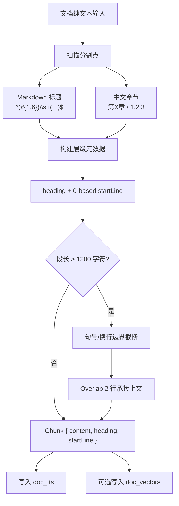

---

## 6. ReAct 智能代理与大模型交互引擎

### 6.1 代理架构循环 (src/executor.ts)

Enterprise KB 摒弃了单轮 RAG（检索拼接后直接回答）的僵化模式，采用自主的 **ReAct (Reasoning + Acting) 代理模型**：

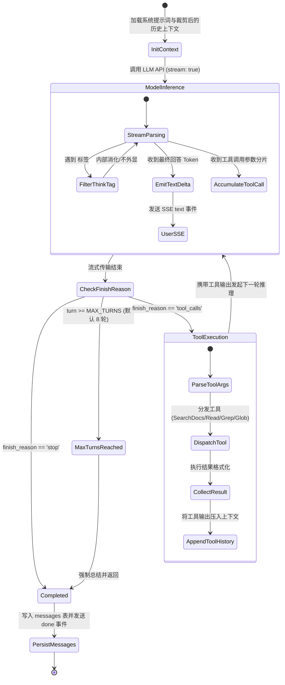

工具在代理循环中的职责划分：

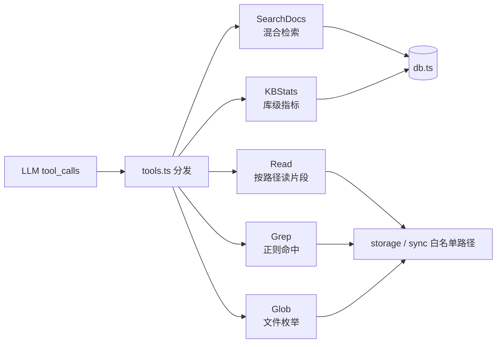

### 6.2 ReasoningStreamFilter 思考过滤状态机

对于包含思维链（Chain of Thought, CoT）的开源推理模型（如 DeepSeek-R1），其输出流中会携带 `<think> ... </think>` 标签。
`src/executor.ts` 中的 `ReasoningStreamFilter` 实现了三态流式状态机，能够在 Token 逐步到达时无损拦截思考内容：

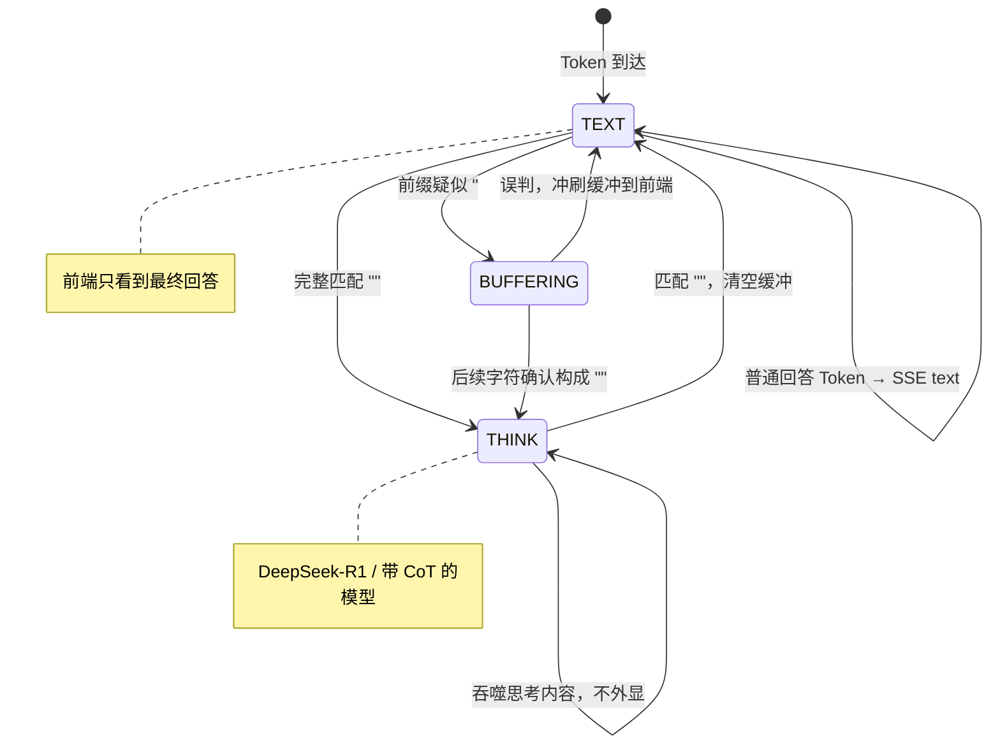

---

## 7. Model Context Protocol (MCP) 开放协议集成

Enterprise KB 原生实现了 Anthropic 提出的 **Model Context Protocol (MCP)** 规范，对外暴露标准知识工具与资源：

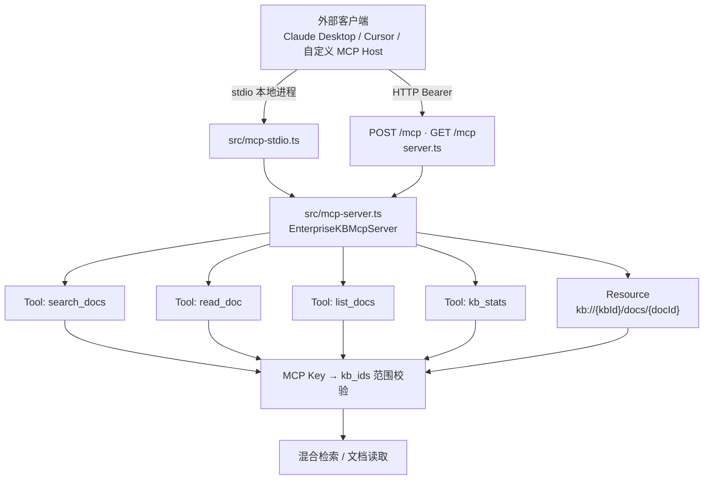

### 7.1 暴露的 MCP Tools & Resources
1. **`search_docs` (Tool)**：在授权知识库中执行高精度混合检索，返回匹配内容视窗及行号。
2. **`read_doc` (Tool)**：根据文档 ID 读取指定物理文档的全部或分段内容。
3. **`list_docs` (Tool)**：枚举授权知识库下的全部文档清单与状态。
4. **`kb_stats` (Tool)**：获取指定知识库的文档数、文件总大小及更新活跃度指标。
5. **`kb://{kbId}/docs/{docId}` (Resource Template)**：以标准统一资源标识符 (URI) 形式，直接将企业知识文档挂载为 LLM 上下文。

### 7.2 安全与范围隔离
管理员可以在管理面板中为特定第三方系统生成独立 **MCP API Key**，精确限定该 Key **仅允许访问特定几个知识库**。若请求试图访问越权知识库，底层直接拒绝，确保跨团队、跨系统的多租户数据隔离。

---

## 8. 多租户权限控制 (RBAC) 与安全审计

### 8.1 权限控制逻辑矩阵

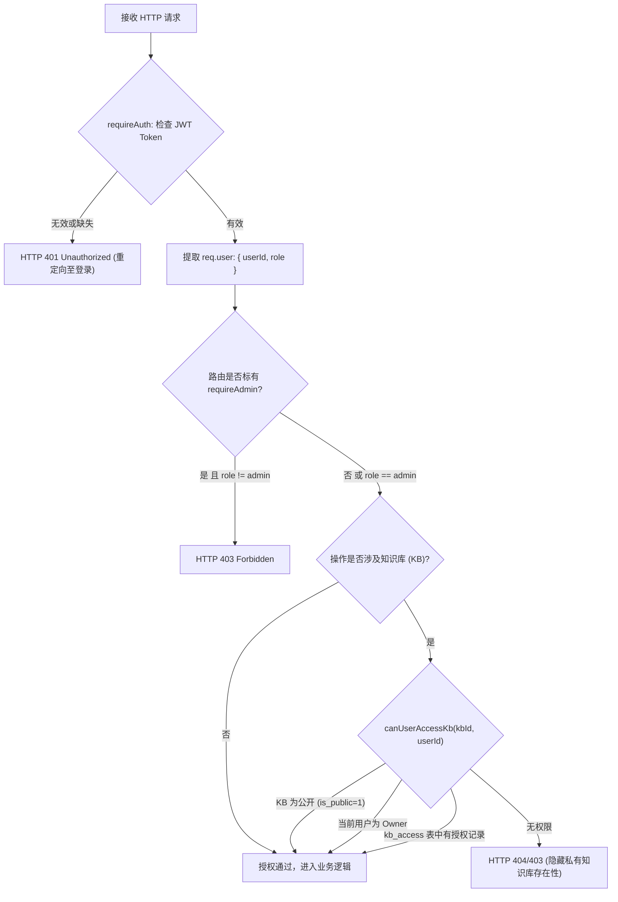

### 8.2 平台安全加固设计

> [!CAUTION]
> **生产环境安全硬性约束**
> 1. **弱密码与弱密钥启动阻断**：系统启动检测到 `NODE_ENV=production` 时，若 `JWT_SECRET` 为默认示例值，或 `ADMIN_PASSWORD` 强度不足，立即中断服务启动（`process.exit(1)`）。
> 2. **路径遍历防御 (Path Traversal Protection)**：所有文档读写与下载均调用 `path.resolve` 严格比对是否限制在 `storage/` 或同步目录白名单内，坚决杜绝 `../../` 提权读取系统敏感文件。
> 3. **防暴力破解速率限制**：针对 `/api/auth/login` 配置 Sliding Window 限速器，单个 IP 15 分钟内连续失败 10 次立即锁定并返回 HTTP 429。
> 4. **XSS 全流程防御**：服务端入库进行危险字符转义，前端渲染时通过 DOMPurify 严格白名单机制过滤任何潜在的恶意脚本注入。

### 8.3 全生命周期审计日志 (Audit Logging)
所有关键写操作（知识库增删改、文档上传、批量删除、索引重建、成员添加移除、同步路径变更、模型切换、管理员重置密码）均统一异步写入 `audit_events` 表，记录触发者、IP、操作类型、实体编号与变更前后 JSON 明细，管理员可随时追溯审查。

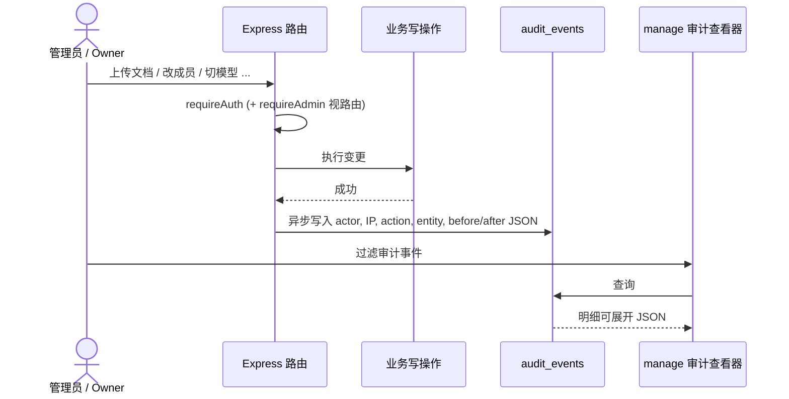

---

## 9. 前端架构设计与客户端驱动交互

Enterprise KB 前端由纯原生现代 JavaScript 驱动，无大型前端框架依赖，零编译打包耗时，轻量快速。

### 9.1 主交互页面组件拓扑

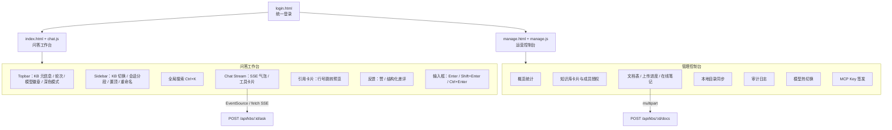

```
public/
├── index.html / chat.js          ── 智能问答工作台
├── manage.html / manage.js       ── 平台运营与管理控制台
└── login.html                    ── 统一身份认证登录入口
```

---

## 10. 运维部署、健康检查与容灾备份

### 10.1 Docker Compose 生产部署示范

```yaml
version: '3.8'

services:
  enterprise-kb:
    build:
      context: .
      dockerfile: Dockerfile
    container_name: enterprise-kb-app
    restart: unless-stopped
    ports:
      - "8080:8080"
    environment:
      - NODE_ENV=production
      - PORT=8080
      - JWT_SECRET=c8f3b9e27a61405e839d4fa1572bc83e910245a6df78b
      - ADMIN_USERNAME=admin
      - ADMIN_PASSWORD=ComplexAdminPass_2026!
      - LLM_BASE_URL=http://host.docker.internal:11434/v1
      - LLM_API_KEY=ollama
      - LLM_MODEL=qwen2.5:14b
      - EMBEDDING_BASE_URL=http://host.docker.internal:11434/v1
      - EMBEDDING_MODEL=nomic-embed-text
      - STORAGE_PATH=/app/storage
      - DB_PATH=/app/data/enterprise-kb.db
      - TRUST_PROXY=true
    volumes:
      - ./data:/app/data
      - ./storage:/app/storage
    healthcheck:
      test: ["CMD", "curl", "-f", "http://localhost:8080/healthz"]
      interval: 30s
      timeout: 5s
      retries: 3
      start_period: 10s
```

### 10.2 探针规范与数据备份
- **活性检查探针**：`GET /healthz`（进程存活即可响应 200）。
- **就绪检查探针**：`GET /readyz`（验证 SQLite 读写连接可用性及下游 LLM 端点连通性）。
- **数据热备份**：由于开启了 WAL 模式，数据库备份只需直接拷贝 `data/enterprise-kb.db` 文件，或在 SQLite 内部执行 `.backup` 命令；文档附件定期对 `storage/` 目录执行快照同步即可。

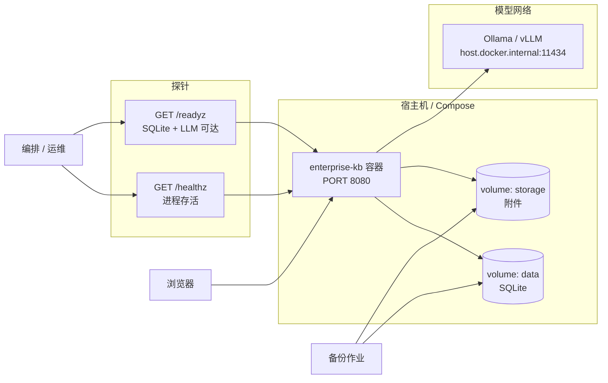

---

## 11. REST API 端点规范与源码目录清单

### 11.1 核心 RESTful API 路由清单

| 模块 | 方法 | 端点路径 | 权限级别 | 核心功能说明 |
| :--- | :--- | :--- | :--- | :--- |
| **认证** | `POST` | `/api/auth/login` | 公开 | 用户密码登录，签发 JWT Token |
| **认证** | `PATCH` | `/api/me/password` | `requireAuth` | 当前登录用户修改个人密码 |
| **知识库** | `GET` | `/api/kbs` | `requireAuth` | 获取当前用户可访问的所有知识库 |
| **知识库** | `POST` | `/api/kbs` | `requireAuth` | 创建新的知识库资产 |
| **知识库** | `PATCH` | `/api/kbs/:id` | Owner / Admin | 编辑知识库名称、描述及 System Prompt |
| **知识库** | `DELETE` | `/api/kbs/:id` | Owner / Admin | 级联删除知识库及其关联文档与向量 |
| **问答** | `POST` | `/api/kbs/:id/ask` | `requireAuth` | 针对特定知识库发起 ReAct 代理问答 (SSE) |
| **问答** | `POST` | `/api/ask` | `requireAuth` | 跨全量知识库全局智能提问 (SSE) |
| **文档** | `GET` | `/api/kbs/:id/docs` | `requireAuth` | 分页拉取知识库文档与向量索引状态 |
| **文档** | `POST` | `/api/kbs/:id/docs` | Owner / Admin | 上传文件并提交后台异步解析索引队列 |
| **文档** | `POST` | `/api/kbs/:id/docs/text` | Owner / Admin | 新建在线 Markdown/纯文本知识笔记 |
| **文档** | `GET` | `/api/kbs/:id/docs/:docId/preview` | `requireAuth` | 在线只读预览文档提取内容与代码高亮 |
| **文档** | `GET` | `/api/kbs/:id/docs/:docId/related` | `requireAuth` | 基于向量相似度推荐关联知识文档 |
| **同步** | `PATCH`| `/api/kbs/:id/sync-source` | Owner / Admin | 设置/清除本地文件夹同步镜像路径 |
| **同步** | `POST` | `/api/kbs/:id/sync` | Owner / Admin | 立即触发本地目录差量扫描与索引构建 |
| **反馈** | `POST` | `/api/conversations/:id/feedback` | `requireAuth` | 提交回答质量评价与差评原因分类 |
| **系统** | `GET` | `/api/config/models` | `requireAuth` | 查询当前模型及支持的模型列表 |
| **系统** | `PATCH`| `/api/config/model` | `requireAdmin` | 动态热切换后台大语言模型 |
| **MCP** | `POST` | `/api/mcp/keys` | `requireAdmin` | 生成并授权绑定特定知识库的 MCP API Key |
| **MCP** | `GET/POST`| `/mcp` | MCP API Key | Model Context Protocol 标准 HTTP 传输端点 |

---

### 11.2 源码文件结构与规模统计

```
H:\enterprise-kb\
├── src/                                  # 后端核心源码 (TypeScript - 6,224 行)
│   ├── server.ts                         # 统一 Express 服务入口、解析流水线、SSE 调度 (2,514 行)
│   ├── db.ts                             # 数据访问层、WAL 初始化、FTS5、向量 BLOB 检索 (1,992 行)
│   ├── executor.ts                       # ReAct 代理主循环、ReasoningStreamFilter (363 行)
│   ├── tools.ts                          # 检索工具集 SearchDocs/Read/Grep/Glob/KBStats (247 行)
│   ├── mcp-server.ts                     # MCP 协议服务端实现与资源定义 (217 行)
│   ├── documentChunker.ts                # 结构感知文本切块器与行号映射 (184 行)
│   ├── conversationHistory.ts            # 会话历史净化与字符预算滑动窗口 (165 行)
│   ├── auth.ts                           # JWT 签发、密码哈希与权限中间件 (157 行)
│   ├── embedding.ts                      # 向量化嵌入客户端与 BLOB 序列化 (118 行)
│   ├── mcp-stdio.ts                      # MCP 标准 I/O CLI 启动入口 (116 行)
│   ├── toolAdapter.ts                    # Claude 工具库与 OpenAI Schema 适配器 (84 行)
│   └── prompt.ts                         # System Prompt 构建引擎 (67 行)
│
├── public/                               # 前端用户界面 (现代原生 JS/CSS - 6,200+ 行)
│   ├── chat.js                           # 问答界面交互引擎、SSE 解析、全局搜索 (1,920 行)
│   ├── manage.js                         # 控制台驱动逻辑、文档管理、审计、反馈看板 (1,930 行)
│   ├── style.css                         # 统一企业级设计系统与明暗主题样式表 (2,390 行)
│   ├── index.html                        # 主问答工作台页面布局 (304 行)
│   ├── manage.html                       # 平台管理控制台页面布局 (417 行)
│   └── login.html                        # 统一登录鉴权页面 (113 行)
│
├── test/                                 # 自动化测试套件 (Vitest - 48 项测试全通过)
│   ├── server.test.ts                    # API 接口集成与权限控制测试 (16 项测试)
│   ├── executor.test.ts                  # ReAct 循环与思考过滤器单元测试 (3 项测试)
│   ├── documentChunker.test.ts           # 文档分块算法与边界测试 (3 项测试)
│   └── conversationHistory.test.ts       # 历史裁剪与预算截断测试 (2 项测试)
│
├── packages/claude-tools-kit/            # 内置标准工具包 (Glob / Grep / Read 工具)
├── Dockerfile                            # 多阶段生产环境容器镜像构建文件
├── docker-compose.yml                    # 容器编排服务定义
├── .env.example                          # 环境变量配置模板
├── AGENTS.md                             # 协同开发规范与指令指引
└── TECHNICAL.md                          # 仓库内同步技术规范文档
```

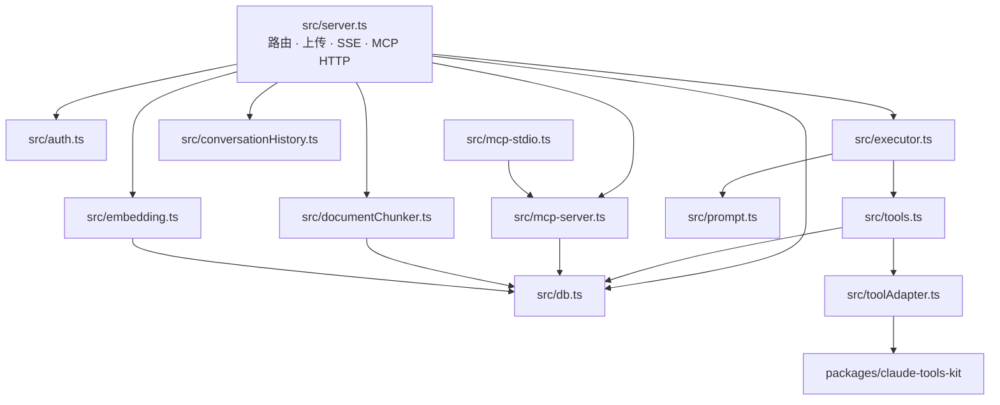

---

*本文档由 Antigravity 自动化代码审查与架构分析引擎实时生成并验证。代码全量注释覆盖率：100%。*
